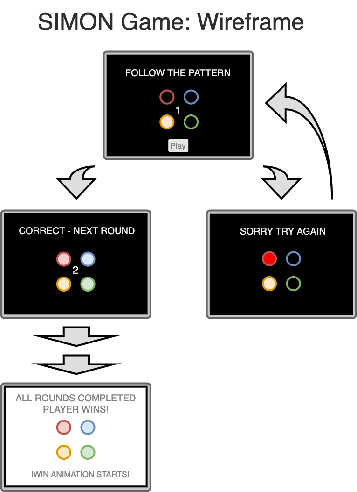
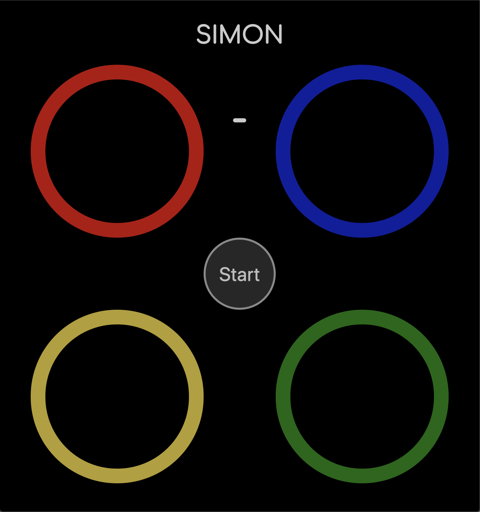
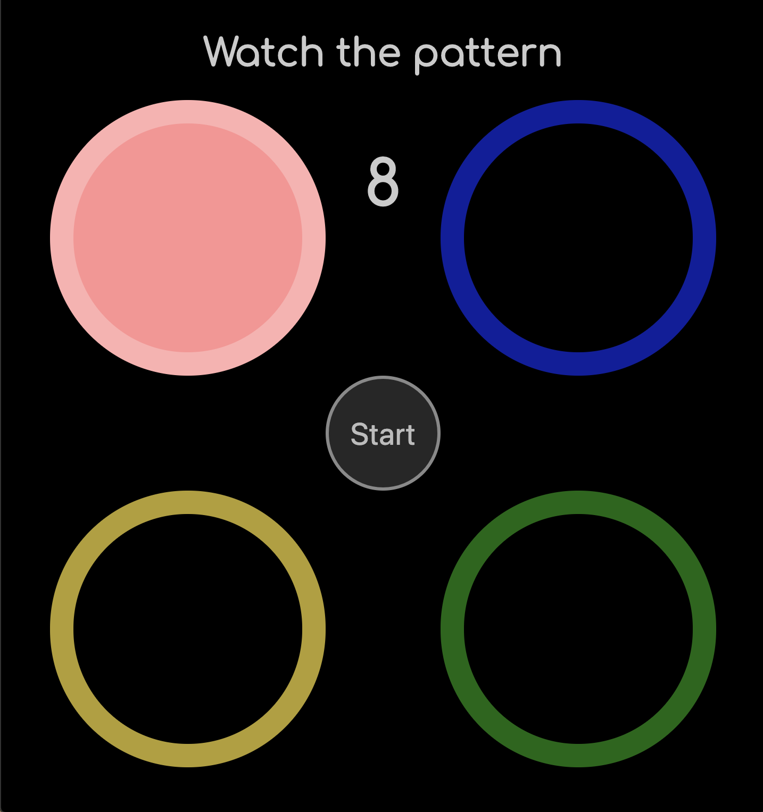
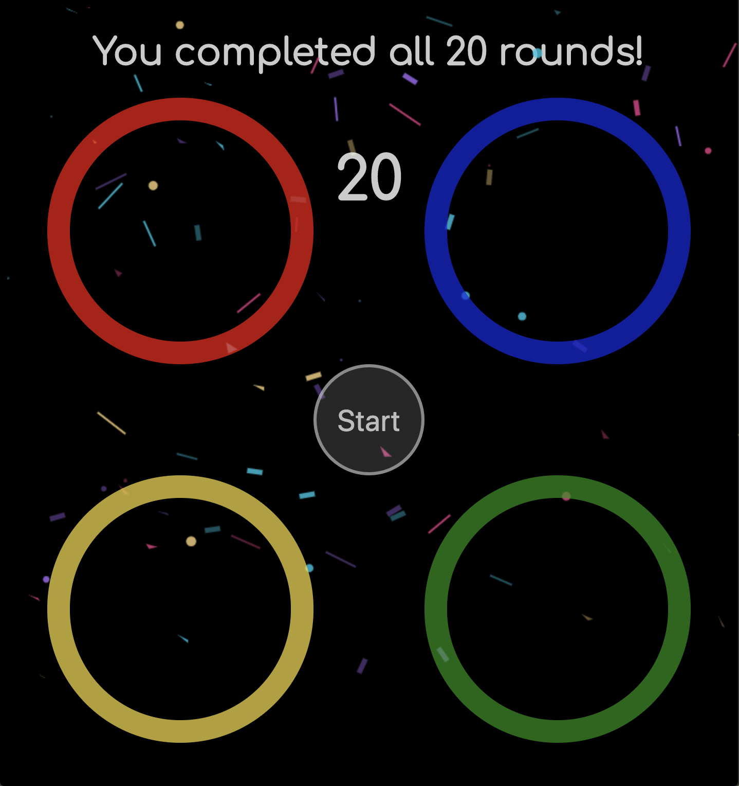

# Simon Game
##
## Objective:
### - Create a browser-based version of the classic game Simon.
##
##
## To play the game:
### Click [here](https://bcarteratx.github.io/project1-simon/) to play the game.
##
##
## Motivation:
### I first played Simon as a young child and was instantly drawn in by the lights and sounds, and captivated by the challenge of repeating the pattern in the correct sequence. Now as an adult I better apreciate how this simple but challenging game can help improve attention and short-term memory.
## Prototype:
### Here is an initial wire-frame of how I wandted the game look and play like:

##
##
## Finished Game:
### Screen shots of the completed game:

##
##

##
##

##
##
##
## Technology Implemented:
- JavaScript
- CSS
- HTML
- Git 
- animate.css
- confetti.js

## Credits:
- animate.css https://daneden.github.io/animate.css/ Daniel Eden
- confetti-js https://github.com/Agezao/confetti-js#readme Agezao
- sound files https://www.freecodecamp.org/learn/ freecodecamp
   

## Pseudocode:
This game starts by flashing a sequence, initially with one flash. The player then needs to click the same button that flashed to advance to the next round. If the player does not hit the right button the round restarts. Advancing to the next round adds one more step to the pattern. If the player advances through all 20 rounds they win the game.

- Player clicks start button
  - All lights flash to indicate game start
  - Round = 1
  - Generate computer pattern (array starting w/ one random value)
- Flash computer pattern
- Player clicks button
  - Push button value to player array
    - If correct (next round)
    - Else (restart round)	
- Next Round
  - Round += 1
  - Push one random to computer pattern (array)
- Flash computer pattern
- Player clicks button
  - Push button value to player array
    - If correct (wait for next move)
    - Else incorrect (restart round)
    - If all player moves are correct (move to next round)◊
- When all Rounds are complete
  - Player wins
  - Winning message is displayed
  - Winning animations start

## Minimum Viable Product:
- As a user, I should be able to click a button to start the game.
- As a user, I Should be able to watch a random pattern of flashing lights.
- As a user, I should be able to push the buttons and have them light up.
- As a user, when I enter the right pattern I move to the next round, adding another step to the sequence.
- As a user, when I don't enter the right pattern I should get to start the round over.
- As a user, if I complete 20 rounds I should win the game.

## Stretch Goals:
- ~~Animate wrong button press~~
- ~~Add confetti to win screen~~
- Add strict mode to restart from round 1 when player makes a wrong move
- Add hard mode increase game speed with rounds completed
- different sound options (record my own custom sounds)
